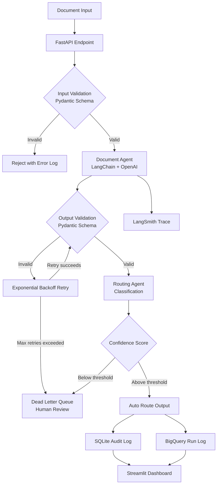
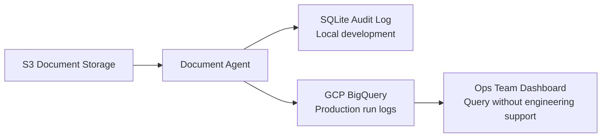

# System Architecture

## REQUEST FLOW

```mermaid
flowchart TD
    A[Document Input] --> B[FastAPI Endpoint]
    B --> C{Input Validation\nPydantic Schema}
    C -->|Invalid| D[Reject with Error Log]
    C -->|Valid| E[Document Agent\nLangChain + OpenAI]
    E --> F{Output Validation\nPydantic Schema}
    F -->|Invalid| G[Exponential Backoff Retry]
    G -->|Max retries exceeded| H[Dead Letter Queue\nHuman Review]
    G -->|Retry succeeds| F
    F -->|Valid| I[Routing Agent\nClassification]
    I --> J{Confidence Score}
    J -->|Below threshold| H
    J -->|Above threshold| K[Auto Route Output]
    K --> L[SQLite Audit Log]
    K --> M[BigQuery Run Log]
    L --> N[Streamlit Dashboard]
    M --> N
    E --> O[LangSmith Trace]
```

## DATA LAYER

```mermaid
flowchart LR
    A[S3 Document Storage] --> B[Document Agent]
    B --> C[SQLite Audit Log\nLocal development]
    B --> D[GCP BigQuery\nProduction run logs]
    D --> E[Ops Team Dashboard\nQuery without engineering support]
```
