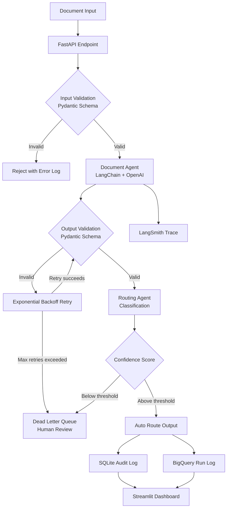

# Multi-Agent Document Automation System

[](https://github.com/Avvv19/local-ai-agent-workflow/actions/workflows/ci.yml)
[](https://www.python.org/downloads/)
[](https://github.com/astral-sh/ruff)

Agent pipeline converting document requests into extracted fields, classified summaries, and routed review outputs. Built for production: schema-validated, retry-safe, and fully auditable.

---

## THE PROBLEM IT SOLVES

Manual document review creates bottlenecks in every document-heavy operation. Teams spend time reviewing every incoming file when they should only see the ones that need a decision. This system routes documents automatically. Teams review exceptions. Everything else processes without human touch.

---

## ARCHITECTURE



See [ARCHITECTURE.md](ARCHITECTURE.md) for full data layer diagram.

---

## WHAT MAKES IT PRODUCTION-GRADE

**Pydantic validation at every agent step**
LLM output is unreliable by default. Every agent response is validated against a strict schema before passing to the next step. Invalid outputs are caught before they corrupt downstream systems.

**Exponential backoff retry logic**
API rate limits and transient failures are handled with exponential backoff. The system retries intelligently rather than failing hard on temporary issues.

**SQLite audit logging**
Every document processed, every agent decision made, every output produced is logged with a timestamp and trace ID. Any result can be traced back to its source document.

**LangSmith observability**
LangChain traces are sent to LangSmith in real time. Latency, token usage, and chain execution are visible without instrumenting the code manually.

**Human-review checkpoints**
Documents that score below the confidence threshold are routed to a human review queue. The system never silently passes uncertain outputs.

**GitHub Actions CI pipeline**
Every push runs ruff linting, mypy type checking, and pytest. Container builds are verified on every merge to main.

---

## TECH STACK

| Layer | Tool |
|---|---|
| Agent Orchestration | LangChain, OpenAI API |
| API Layer | FastAPI |
| Output Validation | Pydantic v2 |
| Observability | LangSmith |
| Storage | SQLite (audit), GCP BigQuery (production logs) |
| Infrastructure | Docker, Terraform |
| UI | Streamlit |
| Testing | pytest, GitHub Actions |

---

## RUNNING LOCALLY

1. Clone the repo
2. Copy `.env.example` to `.env` and add your API keys
3. `docker-compose up`
4. Open `localhost:8501` for the Streamlit UI

---

## RUNNING TESTS

```bash
pytest tests/ -v --cov=src
```

---

## DESIGN DECISIONS

**Why LangChain over raw OpenAI API calls**
LangChain provides structured chain execution, built-in retry handling, and LangSmith integration. For a multi-step agent workflow, the abstraction is worth the overhead.

**Why SQLite for local audit logs**
SQLite requires zero infrastructure for local development. Production deployments use GCP BigQuery for structured run logs with partitioned schemas for efficient querying.

**Why Pydantic for output validation**
LLM outputs are strings. Business logic needs typed, validated structures. Pydantic bridges the gap with clear error messages when the model produces malformed output.

---

## STATUS

Production pattern. Deployed via AWS Lambda for orchestration with S3 for document storage.
