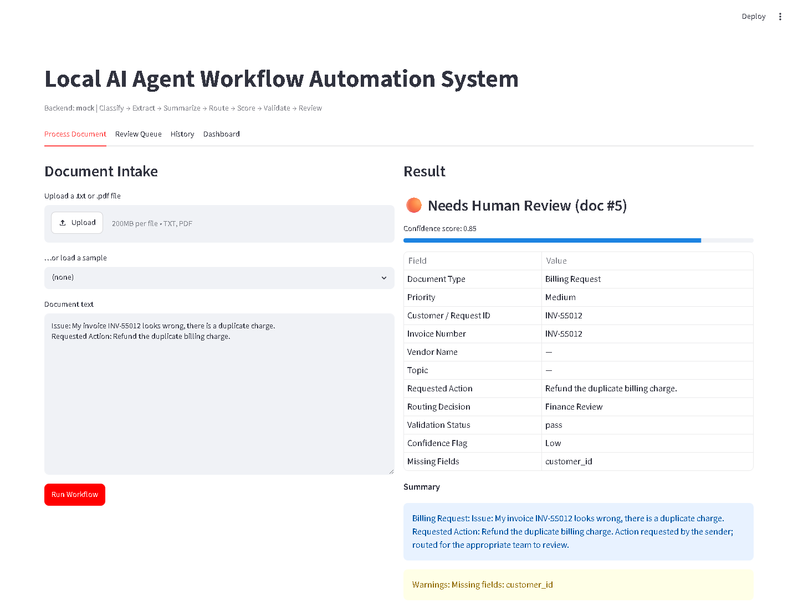
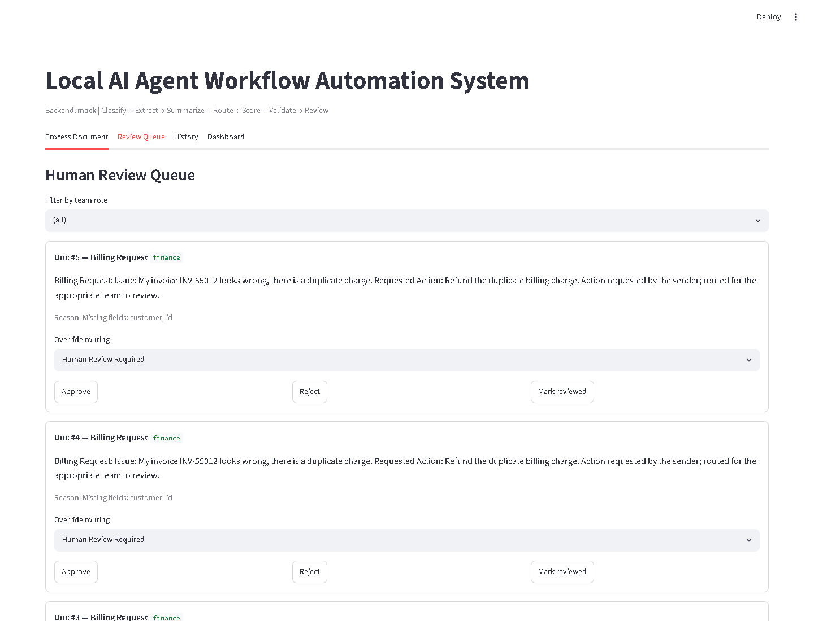
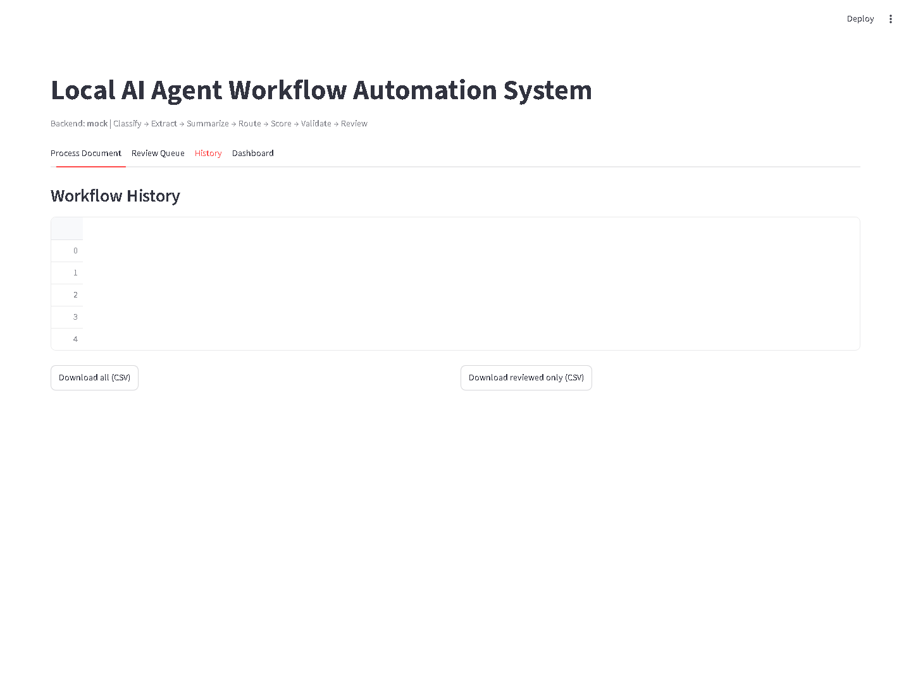
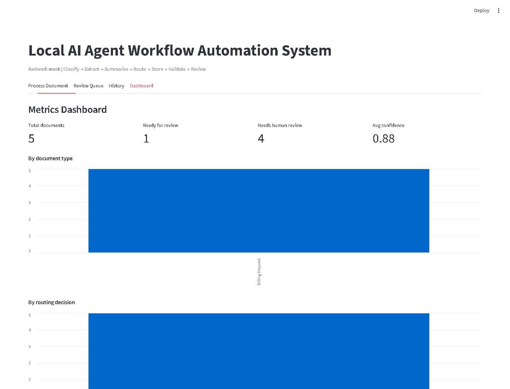

<div align="center">


<br/>


<br/><br/>


</div>

---

## What it does

This project takes unstructured business documents - tickets, forms, emails, requests, operational notes — and turns them into clean, structured, review-ready records using a local agentic AI pipeline. Every record gets classified, key fields extracted, a summary generated, a routing decision made, validation checked, a confidence score assigned, and a human-review flag set if anything looks uncertain.

It supports multiple angles:

- Agentic workflow, step orchestration, backend APIs, validation gates, local AI execution
- Text preprocessing, classification, structured output, evaluation metrics, decision support

The full pipeline:

```
received → clean → classify → extract → summarize → route → score → validate → escalate → log
```

Each step is small, independently testable, and fully logged. A rule-based validation gate plus a transparent confidence score decide whether a result is *Ready for Review* or flagged for *Human Review*.

---

## The business problem it solves

Teams still handle incoming tickets, forms, and requests by hand — read it, classify it, pull out the fields, summarize it, decide where it goes, check for missing info, prep it for review. That's slow, inconsistent, and doesn't scale.

This workflow automates that entire loop while keeping a human in the loop for anything low-confidence or incomplete.

---

## Screenshots

### Process & Result



### Review Queue



### History



### Dashboard



---

## Evaluation results

Tested on a labelled sample of 28 documents across 7 categories (including 6 incomplete, 4 ambiguous, and 10 that should trigger human review):

| Metric | Result |
|:---|:---:|
| JSON validity | 100% — 28/28 |
| Classification match | 100% — 28/28 |
| Routing match | 100% — 28/28 |
| Required-field completion | 78.6% — 22/28 |
| Human-review precision | 1.00 |
| Human-review recall | 1.00 |

These numbers reflect that the backend logic and test labels are aligned, and that the escalation behaviour works as intended — not a claim about real-world model accuracy.

---

## Document categories and routing

| Category | Routed to |
|:---|:---|
| Billing Request | Finance Review |
| Support Ticket | Customer Support Review |
| Customer Complaint | Operations Review |
| Vendor Request | Technical Review |
| Internal Operations Request | Operations Review |
| Policy Question | General Queue |
| General Inquiry | General Queue |

Different document types expect different required fields, so validation is per-type. A billing request needs a customer ID and invoice number; a support ticket needs an issue description and priority.

---

## Output schema

Every processed document produces a structured record like this:

```json
{
  "document_type":     "Billing Request",
  "priority":          "Medium",
  "customer_id":       "CUS-1029",
  "invoice_number":    "INV-88421",
  "issue_summary":     "Customer was billed twice — suspected overcharge.",
  "requested_action":  "Refund the duplicate charge and reissue the invoice.",
  "summary":           "Billing Request: customer reports a duplicate charge and asks for a correction.",
  "routing_decision":  "Finance Review",
  "missing_fields":    [],
  "validation_status": "pass",
  "review_status":     "Ready for Review",
  "confidence_flag":   "Acceptable",
  "confidence_score":  1.0
}
```

---

## Confidence scoring

The confidence score is calculated from transparent, verifiable workflow checks — not a black-box LLM number. It starts at 1.0 and loses points for:

```python
deductions = {
    "invalid_json":                -0.40,
    "failed_validation":           -0.30,
    "low_classification_conf":     -0.20,
    "each_missing_required_field": -0.10,
    "weak_or_empty_summary":       -0.10,
}
# Documents with score < 0.6 are automatically routed to Human Review
```

---

## When human review is triggered

A document is escalated when any of the following is true:

- Required fields are missing
- The document type could not be determined confidently
- The routing decision is unsupported or validation fails
- Confidence score is below 0.6
- JSON output is still invalid after a retry
- The summary is empty or too weak
- The input text is too short or ambiguous

---

## Architecture

| Layer | What it does |
|:---|:---|
| Frontend | Streamlit UI — process documents, role-filtered review queue, history, dashboard |
| Backend | FastAPI — optional API-key auth, CORS, Prometheus `/metrics`, CSV export |
| Orchestration | Plain-Python step orchestrator with a validation gate and confidence scoring |
| Model | Ollama + Llama 3 (optionally via LangChain), or a deterministic mock for testing |
| Validation | Rule-based Python checks + transparent confidence scoring |
| Data | SQLAlchemy ORM → SQLite or PostgreSQL; Alembic for schema migrations |
| Observability | Structured logging + Prometheus metrics |

---

## API endpoints

| Method | Path | What it does |
|:---:|:---|:---|
| GET | `/health` | Health check and active backend info |
| POST | `/process` | Run the workflow on pasted text |
| POST | `/upload` | Run the workflow on a .txt or .pdf |
| GET | `/result/{id}` | Full record and workflow trace |
| GET | `/history` | Recently processed documents |
| GET | `/review-queue?role=` | Open review items, filterable by role |
| POST | `/review/{id}/resolve` | Resolve, approve, or reject |
| PATCH | `/result/{id}/route` | Override the routing decision |
| GET | `/metrics-summary` | Aggregate counts as JSON |
| GET | `/export.csv` | Export history as CSV |
| GET | `/metrics` | Prometheus exposition format |

---

## Running it locally

```bash
# Install dependencies and run migrations
pip install -r requirements.txt
make migrate          # or the app auto-creates tables on first run

# Start the services (run these in separate terminals)
make api              # API at http://localhost:8000/docs
make ui               # UI  at http://localhost:8501

# Tests and checks
make test             # pytest + coverage
make lint             # ruff
make eval             # evaluation over the labelled sample set
```

To use a real local model:

```bash
ollama pull llama3
export LLM_BACKEND=ollama        # or "langchain" (needs: pip install langchain-ollama)
python scripts/check_ollama.py   # verify Ollama is reachable
python -m app.main
```

With Docker:

```bash
docker compose up --build                  # mock backend, API + UI
docker compose --profile ollama up         # adds a local Ollama service
docker compose --profile postgres up       # switches to PostgreSQL
```

---

## Tech stack


---

## Limitations

- The default backend uses deterministic mock logic for reproducibility — it's not running a real LLM unless you configure Ollama.
- Ollama + Llama 3 require local installation and are not exercised by the bundled tests.
- The evaluation sample set is small (28 documents).
- Scanned PDFs need OCR, which isn't included yet — text-based PDFs work fine.
- This is a local portfolio project, not an enterprise production system.

---

## What's planned

- OCR support for scanned PDFs
- Document-type-specific extraction schemas
- Per-user authentication and audit trails
- Alerting on top of the Prometheus metrics
- Model-based confidence scoring
- Multi-tenant review queues
- Deployment automation
- Historical evaluation dashboard

---

<div align="center">

Built by **Venkata Vivek Varma Alluru** &nbsp;·&nbsp; AI Engineer &nbsp;·&nbsp; ML Engineer &nbsp;·&nbsp; Data Scientist

[](https://github.com/Avvv19)
[](https://linkedin.com)
[](https://medium.com)

*"The best AI system is the one that solves real problems reliably at scale."*

</div>


