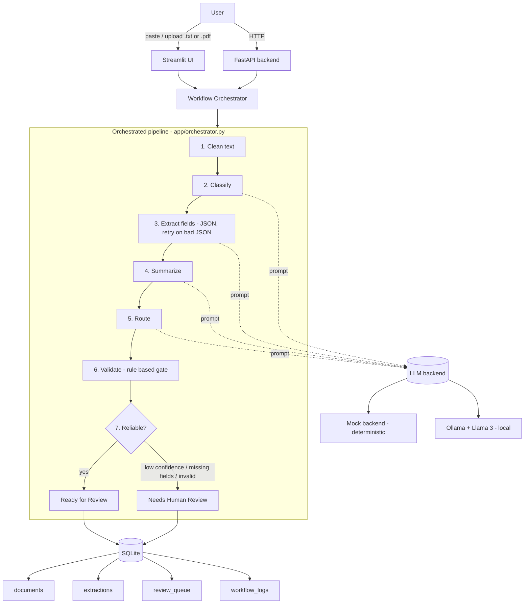

# Architecture

## System diagram

## Request lifecycle

1. A document arrives via the Streamlit UI or the `/process` (text) or
   `/upload` (.txt/.pdf) API endpoints.
2. The orchestrator runs the six processing steps, calling the LLM backend for
   the classify/extract/summarize/route steps.
3. Extraction retries with a stricter prompt if the JSON is malformed.
4. The rule-based validation gate checks allowed values, required fields, and a
   non-empty summary.
5. An explicit escalation decision sets the record to *Ready for Review* or
   *Needs Human Review*.
6. The document, structured result, per-step log, and (if flagged) a
   review-queue entry are written to SQLite. The result JSON is also written to
   `data/outputs/`.

## Why these choices

- **Plain-Python orchestration** over an agent framework: deterministic,
  debuggable, and makes the reliability features first-class for a fixed flow.
- **Pluggable LLM backend**: a deterministic mock keeps the project reproducible
  with zero model setup; Ollama provides the real local model.
- **Rule-based validation in Python**, not an LLM: the reliability gate must be
  predictable.
